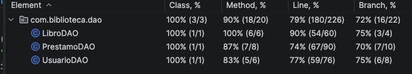

📚 Biblioteca Digital – Sistema de Gestión de Biblioteca

Sistema web desarrollado en Java utilizando Servlets y JSP, que permite administrar una biblioteca digital con gestión de usuarios, catálogo de libros y control de préstamos.

El sistema implementa una arquitectura MVC (Modelo – Vista – Controlador) conectada a una base de datos MySQL, permitiendo diferenciar accesos entre Administrador y Usuario.

🚀 Tecnologías Utilizadas

Java

Jakarta Servlet

JSP

JDBC

MySQL

HTML5

CSS3

Apache Tomcat

Maven

Git / GitHub

🏗 Arquitectura del Proyecto

El sistema sigue el patrón MVC:

Modelo (Model)

Usuario

Libro

Prestamo

DAO (Acceso a datos)

UsuarioDAO

PrestamoDAO

Controladores (Servlets)

LoginServlet

DashboardServlet

UsuarioDashboardServlet

UsuarioServlet

PrestamoServlet

LogoutServlet

Vistas (JSP)

login.jsp

dashboard.jsp

dashboard_user.jsp

usuarios.jsp

prestamos.jsp

👥 Roles del Sistema

El sistema tiene dos tipos de usuarios:

👨‍💼 Administrador

Puede:

Gestionar usuarios

Administrar préstamos

Visualizar el catálogo completo

Prestar libros a usuarios

Registrar devoluciones

👤 Usuario

Puede:

Ver los libros que tiene prestados

Consultar el catálogo de libros

Visualizar disponibilidad de libros

Navegar el catálogo con paginación

📚 Funcionalidades del Sistema
Autenticación

Inicio de sesión

Control de sesión

Redirección según rol

Cierre de sesión

Gestión de Usuarios

Listar usuarios

Crear usuarios

Editar usuarios

Eliminar usuarios

Gestión de Libros

Visualización del catálogo

Estado de disponibilidad

Gestión de Préstamos

Registrar préstamo

Registrar devolución

Actualizar disponibilidad automáticamente

Dashboard

Dashboard de administrador

Dashboard de usuario

Paginación

El catálogo de libros implementa paginación mostrando 10 registros por página.

🗄 Base de Datos

Nombre de la base de datos:

biblioteca

Tablas principales

usuarios

Campos principales:

id

nombre

email

password

rol

libros

Campos principales:

id

titulo

autor

disponible

prestamos

Campos principales:

id

usuario_id

libro_id

fecha_prestamo

fecha_devolucion

👤 Usuarios de Prueba

Administrador

Email:
admin@biblioteca.com

Password:
admin123456

Usuario

Email:
usuario@gmail.com

Password:
user123456

⚙ Instalación del Proyecto
1. Clonar el repositorio

git clone https://github.com/TU-USUARIO/biblioteca-digital.git

2. Crear la base de datos

CREATE DATABASE biblioteca;

3. Crear las tablas y datos iniciales

INSERT INTO usuarios (nombre, email, password, rol)
VALUES
('Administrador','admin@biblioteca.com','admin123456','Administrador'),
('Usuario','usuario@gmail.com','user123456','Usuario');

4. Configurar la conexión a la base de datos

Archivo:

ConexionDB.java

Actualizar los datos:

URL de conexión

usuario de MySQL

contraseña

5. Ejecutar el proyecto

Desplegar el proyecto en:

Apache Tomcat

Abrir en el navegador:

http://localhost:8080/biblioteca/login
````
📂 Estructura del Proyecto


src
├── controller
│ ├── LoginServlet
│ ├── DashboardServlet
│ ├── UsuarioDashboardServlet
│ ├── UsuarioServlet
│ ├── PrestamoServlet
│ └── LogoutServlet
│
├── dao
│ ├── UsuarioDAO
│ └── PrestamoDAO
│
├── model
│ ├── Usuario
│ └── Libro
│
├── util
│ └── ConexionDB
│
└── webapp
├── login.jsp
├── dashboard.jsp
├── dashboard_user.jsp
├── usuarios
├── prestamos
└── css
````
🧪 Pruebas

El proyecto incluye pruebas unitarias para validar la lógica de acceso a datos (DAO), utilizando JUnit.

Las pruebas verifican:

Resultados de la cobertura de las pruebas.




🔒 Seguridad Básica

El sistema incluye:

Control de sesión mediante HttpSession

Redirección según rol

Cierre de sesión seguro

📈 Mejoras Futuras

Hash de contraseñas (bcrypt)

Filtros de autenticación

API REST

Búsqueda de libros

Paginación avanzada

Gestión completa de libros (CRUD)

👨‍💻 Autor

Maximiliano Hillmer

Proyecto académico desarrollado para la implementación de un sistema web de gestión de biblioteca utilizando Java Servlets, JSP y MySQL.

📄 Licencia

Proyecto de uso académico y educativo.